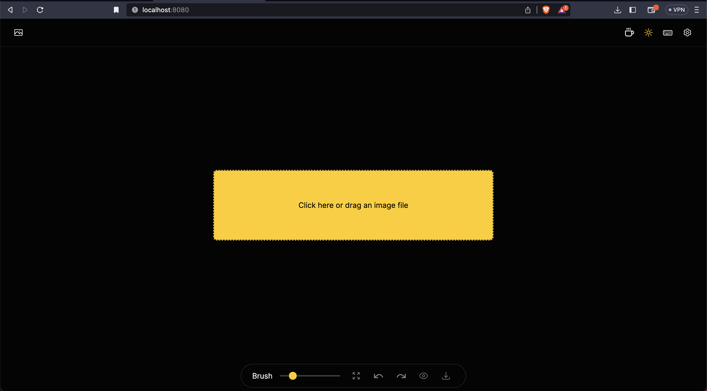
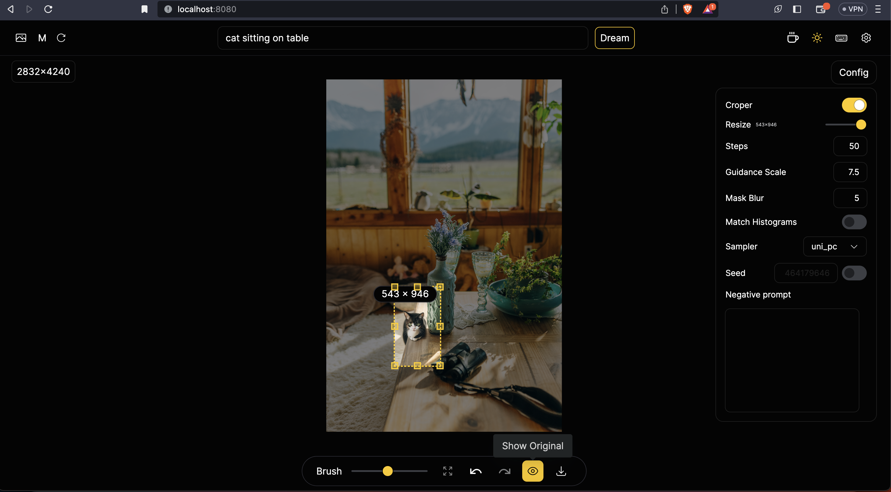

# Pixel Perfect AI


Pixel Perfect AI is an open-source, fully self-hostable inpainting tool powered by state-of-the-art artificial intelligence models. This tool can be used to remove any unwanted object, defect, or individuals from your pictures. It can also erase, replace and add anything in your images, ensuring the highest quality output.

## Getting Started

### Configurations

First, ensure you have met the following requirements:

- You have installed the latest version of Python. (>= 3.7)
```bash
python --version
python3 --version
```
> Learn more [here](https://www.python.org/downloads/)

- You have a Windows/Linux/Mac machine.

### Installation

1. Clone the repository

```bash
git clone https://github.com/KarthikS373/pixel-perfect-ai
cd pixel-perfect-ai
```
2. Create a virtual environment with the latest version of python
```bash
python -m venv venv
```
- MacOS / Linux:
```
source /venv/bin/activate
```
- Windows:
```
./venv/Scripts/activate
```

3. Install the required dependencies
```bash
pip install -r ./config/requirements.txt
```

4. Run the project
```bash
python main.py
```
> This will start the development server and you should be able to see your project running at [http://localhost:8080](http://localhost:8080) in your browser.

## Visuals
Here are some screenshots of out project

- UI: 


